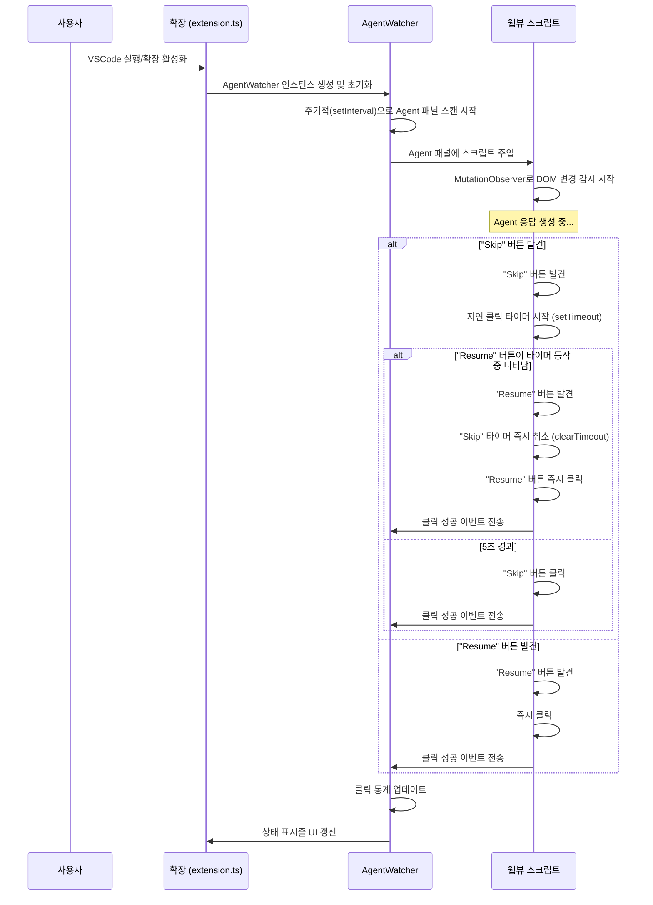

# Cursor Auto Resumer - 프로젝트 컨텍스트

## 1. 프로젝트 개요

Cursor Auto Resumer는 Cursor IDE(또는 VSCode)에서 AI Agent와의 채팅 시 나타나는 **Resume** 및 **Skip** 버튼을 자동으로 감지하고 클릭하는 VSCode 확장 프로그램입니다. 이 확장은 사용자가 Agent와의 대화를 수동으로 재개하거나 건너뛸 필요 없이, 중단 없는 작업 흐름을 유지할 수 있도록 돕는 것을 목표로 합니다.

## 2. 핵심 기능

- **Resume 버튼 자동 클릭**: Agent의 응답이 멈추었을 때 나타나는 "Resume" 버튼을 즉시 클릭합니다.
- **Skip 버튼 지연 클릭**: "Skip" 버튼이 감지되면, 설정된 지연 시간(기본 5초) 후에 클릭합니다.
- **지능형 우선순위 로직**: "Resume" 버튼 감지가 최우선 순위를 가집니다. "Skip" 버튼 클릭을 위한 타이머가 동작하는 중이라도 "Resume" 버튼이 나타나면 즉시 타이머를 취소하고 "Resume"을 클릭합니다.
- **실시간 모니터링**: VSCode 내의 모든 Agent 패널(웹뷰)을 실시간으로 스캔하여 DOM 변경에 즉시 반응합니다.
- **상태 관리 및 UI 통합**: 상태 표시줄 아이콘을 통해 현재 동작 상태(활성/비활성, 총 클릭 수)를 표시하며, 관련 명령어를 제공합니다.
- **높은 설정 유연성**: 기능 활성화 여부, 감지 주기, 버튼 선택자, 디버그 모드 등 대부분의 동작을 사용자가 직접 제어할 수 있습니다.

## 3. 아키텍처

### 3.1. 파일 구조

```
cursor-auto-resumer/
├── src/                    # 확장 프로그램 핵심 로직
│   ├── extension.ts        # 확장 프로그램 진입점, 활성화/비활성화 및 명령어 등록
│   ├── agentWatcher.ts     # Agent 패널 감시, 웹뷰 스크립트 주입, 상태 관리 등 메인 로직
│   ├── webviewScript.ts    # 웹뷰에 주입되어 DOM을 직접 감시하고 버튼을 클릭하는 스크립트
│   ├── config.ts           # VSCode 설정 값을 읽고 관리하는 클래스
│   └── types.ts            # 프로젝트에서 사용되는 타입 정의
│
├── tests/                  # Jest를 이용한 단위/통합 테스트 코드
│   ├── __mocks__/          # VSCode API 등 테스트를 위한 Mock 객체
│   └── *.test.ts           # 각 모듈별 테스트 파일
│
├── package.json            # 확장 정보, 의존성, 명령어, 설정, 스크립트 등 정의
├── tsconfig.json           # TypeScript 컴파일러 설정
├── jest.config.js          # Jest 테스트 프레임워크 설정
├── .eslintrc.js            # ESLint 코드 품질 규칙 설정
├── webpack.config.js       # 소스 코드 번들링을 위한 Webpack 설정 (v1.1.0+)
│
├── .vscode/
│   └── launch.json         # VSCode 디버깅 실행 설정
│
├── out/                    # 컴파일된 JavaScript 파일 (tsc 빌드 시)
├── dist/                   # 번들링된 최종 결과물 (Webpack 빌드 시)
│
├── CONTEXT.md              # 이 파일 (프로젝트 기술 상세 문서)
├── README.md               # 사용자 및 기여자를 위한 프로젝트 소개 문서
├── VSCE_GUIDE.md           # VSIX 패키징 및 Marketplace 배포 가이드
└── LICENSE                 # MIT 라이선스 파일
```

### 3.2. 주요 클래스 및 역할

#### 1. `AgentWatcher` (src/agentWatcher.ts)
- 확장의 핵심 로직을 담당하는 메인 클래스입니다.
- VSCode의 모든 탭과 웹뷰 패널을 주기적으로 스캔하여 Cursor Agent 패널을 식별합니다.
- 식별된 패널에 `webviewScript`를 주입하고, 상태(클릭 수 등)를 관리합니다.
- VSCode 상태 표시줄 UI를 업데이트하고, `ConfigManager`를 통해 설정 변경을 감지합니다.

#### 2. `ConfigManager` (src/config.ts)
- 싱글톤 패턴으로 구현되어 프로젝트 전역에서 설정 값을 일관되게 관리합니다.
- `package.json`에 정의된 `cursorAutoResumer.*` 설정들을 VSCode API를 통해 읽어옵니다.
- 설정 값에 대한 유효성 검사를 수행하고, 디버그 모드에 따라 로그를 출력합니다.
- Skip 버튼 관련 설정(활성화, 지연 시간)을 포함한 모든 설정을 관리합니다.

#### 3. `WebviewScript` (src/webviewScript.ts)
- 실제 웹뷰의 DOM 내부에서 실행될 JavaScript 코드를 생성하는 역할을 합니다.
- `MutationObserver`를 사용하여 DOM의 변경을 실시간으로 감지합니다.
- `ConfigManager`로부터 전달받은 CSS 선택자(Selector)를 사용하여 "Resume"과 "Skip" 버튼을 찾습니다.
- **지연 클릭 로직**: "Skip" 버튼을 발견하면 `setTimeout`으로 지연 클릭을 스케줄링하고, "Resume" 버튼이 나타나면 해당 타이머를 `clearTimeout`으로 취소하는 우선순위 로직을 수행합니다.

#### 4. `extension.ts` (src/extension.ts)
- VSCode 확장의 진입점(`activate`) 및 종료점(`deactivate`)입니다.
- `activate` 시 `AgentWatcher` 인스턴스를 생성하여 자동 감시를 시작합니다.
- `package.json`에 정의된 모든 명령어(활성화/비활성화, 상태 보기 등)를 등록하고, 해당 명령어와 `AgentWatcher`의 메서드를 연결합니다.
- `deactivate` 시 `AgentWatcher`의 리소스를 정리(`dispose`)하여 메모리 누수를 방지합니다.

## 4. 기술 스택

- **언어**: TypeScript
- **플랫폼**: VSCode Extension API
- **테스트**: Jest
- **코드 품질**: ESLint, Prettier
- **번들러**: Webpack

## 5. 동작 순서도



## 6. 개발 및 테스트

- **개발 환경 설정**: `npm install`
- **실시간 컴파일**: `npm run watch`
- **디버깅**: `F5` 키로 Extension Development Host 실행
- **단위 테스트**: `npm test`
- **코드 린팅**: `npm run lint`
- **프로덕션 빌드**: `npm run package` (Webpack 번들링 포함)

## 7. 설정 옵션

### Resume 버튼 설정
- **cursorAutoResumer.enabled**: 자동 Resume 기능 활성화/비활성화
- **cursorAutoResumer.checkInterval**: 체크 간격 (500-10000ms)
- **cursorAutoResumer.customSelectors**: 사용자 정의 CSS 선택자
- **cursorAutoResumer.debugMode**: 디버그 로깅 활성화

### Skip 버튼 설정 (신규)
- **cursorAutoResumer.skipButtonEnabled**: Skip 버튼 기능 활성화/비활성화
- **cursorAutoResumer.skipButtonDelay**: Skip 버튼 클릭 지연 시간 (1000-30000ms)
- **cursorAutoResumer.skipButtonCustomSelectors**: Skip 버튼 사용자 정의 선택자

## 8. 명령어

### 기존 명령어
1. `cursorAutoResumer.enable` - 확장 활성화
2. `cursorAutoResumer.disable` - 확장 비활성화
3. `cursorAutoResumer.checkNow` - 즉시 체크 실행
4. `cursorAutoResumer.toggleDebug` - 디버그 모드 토글
5. `cursorAutoResumer.addCustomSelector` - 사용자 정의 선택자 추가
6. `cursorAutoResumer.showStatus` - 현재 상태 표시

### 신규 명령어 (Skip 버튼)
7. `cursorAutoResumer.enableSkip` - Skip 버튼 기능 활성화
8. `cursorAutoResumer.disableSkip` - Skip 버튼 기능 비활성화
9. `cursorAutoResumer.setSkipDelay` - Skip 버튼 지연 시간 설정

## 9. 동작 플로우

### 버튼 감지 우선순위
1. **Resume 버튼**: 최우선 - 발견 즉시 클릭
2. **Skip 버튼**: 차순위 - 지연 시간 후 클릭
3. **우선순위 로직**: Resume 버튼이 나타나면 Skip 타이머 즉시 취소

### 타이머 관리
- Skip 버튼 발견 시 지연 타이머 시작
- Resume 버튼 발견 시 Skip 타이머 즉시 취소
- 중복 타이머 방지 로직

## 10. 개발 워크플로우

### 1. 개발 환경 설정
```bash
npm install
npm run compile
```

### 2. 디버깅
- F5 키를 눌러 Extension Development Host 실행
- 브레이크포인트 설정 및 디버깅

### 3. 테스트 실행
```bash
npm test
```

### 4. 린팅
```bash
npm run lint
```

### 5. 패키징
```bash
npm run package
```

## 11. 설치 방법

### 1. 로컬 VSIX 설치
```bash
npm run package
code --install-extension cursor-auto-resumer-1.0.0.vsix
```

### 2. 개발자 모드
1. VSCode에서 `Ctrl+Shift+P` (또는 `Cmd+Shift+P`)
2. "Extensions: Install from VSIX..." 선택
3. 생성된 .vsix 파일 선택

### 3. 심볼릭 링크 (개발용)
```bash
ln -s /path/to/cursor-auto-resumer ~/.vscode/extensions/cursor-auto-resumer
```

## 12. 보안 고려사항

### DOM 조작
- 웹뷰 스크립트는 안전한 DOM 조작만 수행
- 사용자 데이터 접근 없음
- 클릭 쿨다운으로 과도한 동작 방지
- **Skip 버튼 타이머 관리로 중복 클릭 방지**

### 권한
- 최소 권한 원칙 적용
- 필요한 VSCode API만 사용

## 13. 성능 최적화

### 메모리 관리
- 적절한 리소스 정리 (dispose 패턴)
- 타이머 및 이벤트 리스너 정리
- **Skip 타이머 적절한 정리**

### CPU 사용량
- 설정 가능한 체크 간격
- 효율적인 DOM 쿼리
- **Resume/Skip 버튼 우선순위 최적화**

## 14. 향후 개선 사항

### 1. 고급 패턴 매칭
- 정규식 기반 텍스트 매칭 개선
- AI 기반 버튼 인식

### 2. 다국어 지원 확장
- 더 많은 언어 패턴 추가
- 지역화 설정

### 3. 통계 및 분석
- 사용 통계 수집
- 성능 메트릭
- **Resume/Skip 버튼 클릭 통계**

### 4. 사용자 경험 개선
- GUI 설정 패널
- 실시간 미리보기
- **Skip 타이머 시각적 표시**

## 15. 문제 해결

### 일반적인 문제
1. **확장이 활성화되지 않음**: VSCode 재시작 필요
2. **Resume 버튼을 찾지 못함**: 사용자 정의 선택자 추가
3. **Skip 버튼을 찾지 못함**: Skip 사용자 정의 선택자 추가
4. **성능 문제**: 체크 간격 조정
5. **Skip 타이머 문제**: 지연 시간 설정 확인

### 새로운 기능 관련 문제
- **Skip 버튼이 클릭되지 않음**: skipButtonEnabled 설정 확인
- **지연 시간이 작동하지 않음**: skipButtonDelay 범위 확인 (1-30초)
- **Resume 우선순위 문제**: 로그에서 타이머 취소 메시지 확인

## 16. 라이선스

MIT License - 자유로운 사용 및 수정 가능

## 17. 기여 방법

1. 이슈 리포트
2. 기능 제안
3. 풀 리퀘스트
4. 문서 개선

---

이 문서는 Cursor Auto Resumer 프로젝트의 전체적인 맥락을 제공합니다. 개발, 사용, 유지보수에 필요한 모든 정보를 포함하고 있습니다. 